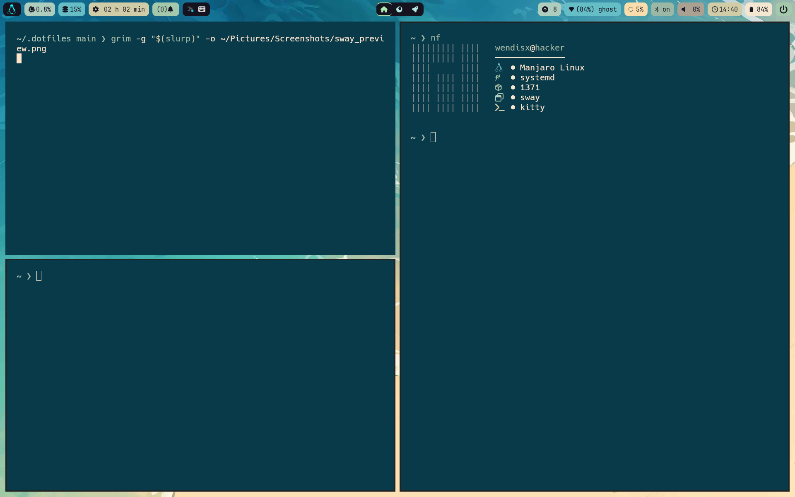
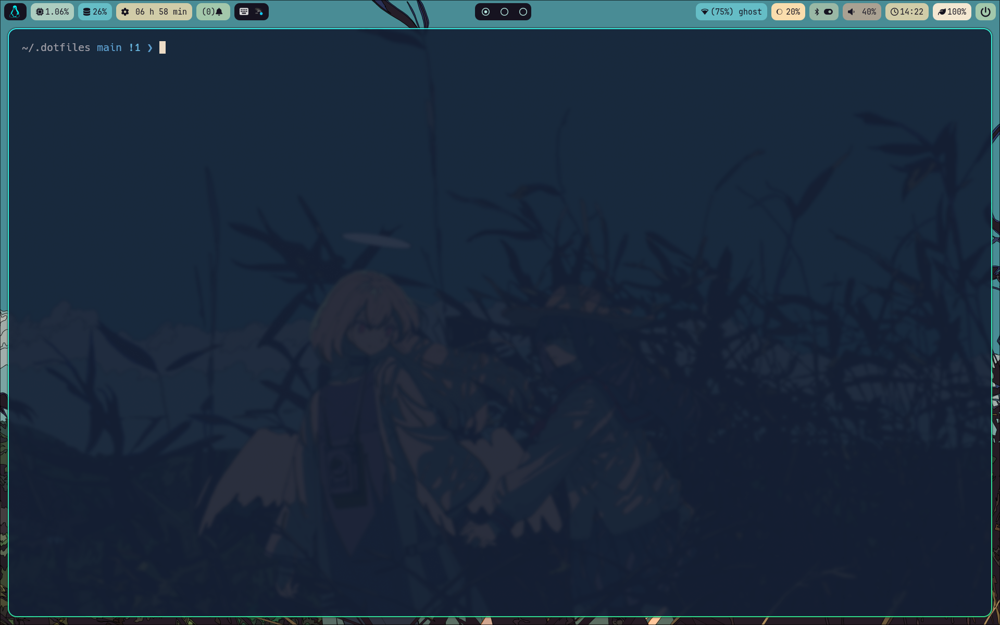

# wensboy's dotfiles

Welcome to my dotfiles, I hope this is helpful to you.
If you want to have a unique working environment on your own Linux device, 
just like me, follow me.

## i3wm-preview

## sway-preview

## hyprland-preview

## Pre-requirements

+ Learn about the mechanics of symbolic linking
+ Basic command-line instructions
+ A device that uses Linux
+ Know how to use gnu/stow
+ Able to solve some problems on their own
+ Enduring curiosity, eternal passion :)

**About device information**

---

>operating system: based on arch

>others: all is ok :) 

---

## Necessary tools

- alacritty

- rofi

- picom

- i3wm
  - feh
  - fcitx5
  - brightnessctl
  - bluetoothctl
  - dunst
  - networkmanager

- polybar
  - pacman-contrib

- kitty

- neovim

- ranger

- neofetch

- dunst

- xborder

- sway
